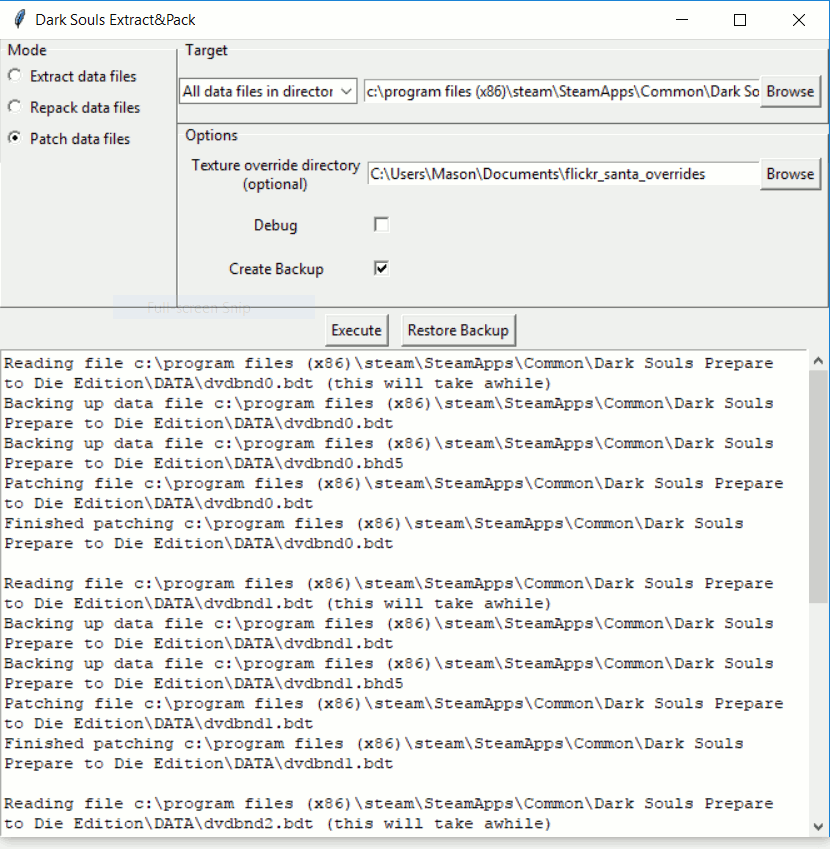

# Overview

Dark Souls Extract &amp; Pack is a tool to unpack and repack data files for Dark Souls 1, allowing mods to be easily distributed without depending on other mods, such as [DSFix](https://www.nexusmods.com/darksouls/mods/19/?). It has full read/write support for the following file formats:
* BDF3 (i.e. BDT) with either header format (BHD5 or BHF3)
* BND3
* DCX
* TPF

It can be used to easily replace every texture in the game, without having to maually dump them with DSFix.

# Usage

To use the GUI, download and launch the latest version of dsextractnpack.exe from [the Releases page](https://github.com/MasonM/ds_extract_and_pack/releases).

The **Mode** section controls the operation to perform, and the **Target** specifies the data file(s) to perform it on. The **Options** section changes depending on the selected mode. There are three modes:

1. **Extract data files** - Unpacks (i.e. unbundles) the data files in "Target" and places the extracted files in the directory given by the **Base directory for extracted files** setting under "Options". Also writes a manifest file that's required when using the "Repack data files" mode.
2. **Repack data files** - Repacks (i.e. re-bundles) data files in the "Base directory for extracted files", optionally using overrides in the directory given by the **Texture override directory** setting.
3. **Patch data files** - Updates the data files in-place using the overrides in the directory given by the "Texture override directory"

The **Create Backup** option is available in the "Repack data files" and "Patch data files" modes, and copies each affected file before modifying it. Use the **Restore Backup** button to restore the backups.

TODO: Document texture_mod_scripts

# Credits
* Borrows code by [HotPocketRemix](https://github.com/HotPocketRemix) from [UnpackDarkSoulsForModding](https://github.com/HotPocketRemix/UnpackDarkSoulsForModding).
* Most reverse engineering was initially done by [Wulf2k](https://github.com/Wulf2k) AFAIK.
